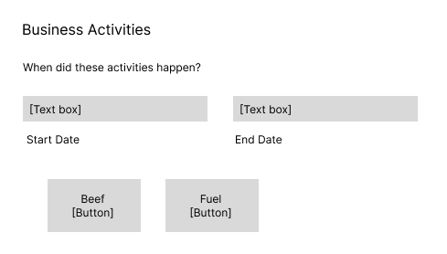
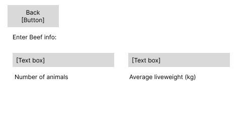
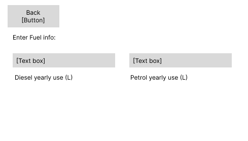
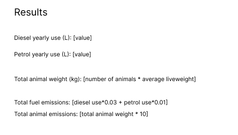

# Agtuary Frontend Code Test

## Background/Context

The project is for a carbon emission platform, whereby users enter information about a business, in this case a farm, and get outputs from an API which they can then view as charts or save as a report.

This test, is an extremely slimmed down version of the platform which tests the fundamentals of React while also retains the core features and interactions of the platform.

## Goal

The end goal of this test is to have a functioning frontend that has the following functionality and features:

-   A set of input pages that the user can switch between
-   Dynamic output page that instantly updates to show the user the latest results
-   Input validation

## Your task

This project is initially set up with 2 components (`components/inputs.tsx` and `components/results.tsx`) and a page component (`pages/calculator.tsx`).

The `input.tsx` component represents the right hand side of the application, while the `results` is the left hand side of the application.

### Inputs

The `inputs` component should be built to the following spec:

#### Design

Default view:

Beef Inputs

Fuel Inputs

The `Default view` is the first view the user sees. They can enter dates in the `Start date` and `End date` text boxes (can either be normal html textbox or date picker). When the user clicks the `Beef` button, the view changes to show the `Beef` inputs (with a back button). Similarly with the `Fuel` button. For all input fields/text boxes (in `Beef` and `Fuel`) the user can only enter numeric values (digits, `,` and `.`).

#### Validation

In the `Beef` inputs, implement the following validation: If the user has entered a value greater than `0` for `Number of animals` `Average liveweight` must be greater than `0`.

In both input pages, the user must enter a value for every text box/input field. If they try to click `Back` without having entered something, an error must appear. If any error or validation message is visible to the user on that page, they cannot go `Back`.

### Results

#### Design

#### Validation

All output values (if it is not a whole number) must be limited to 2 decimal places.

When a user is undefined/has errors/validation issues, you must instead show a `-`.

### Notes

Both `inputs` and `results` component should always be visible at the same time.

Note: these designs are simply sketches and you do not need to follow the exact same layout or design (e.g. having all text boxes on the same line). No styling or design is needed, although thats a plus.

## Outcome

When thinking about the structure of this code, consider the wider application/platform and how many other components/pages are dynamic and change on what they show based on the calculator inputs. For this reason, state management is a crucial aspect as it will facilitate how the rest of the application can utilise the users inputs.

Once done, please either host your code on GitHub/BitBucket/GitLab/other or zip up the folder (without `node_modules`) and send it to one of our team members.

&nbsp;

&nbsp;

&nbsp;

&nbsp;

&nbsp;

&nbsp;

# Existing README below:

# Getting Started with Create React App

This project was bootstrapped with [Create React App](https://github.com/facebook/create-react-app).

## Available Scripts

In the project directory, you can run:

### `npm start`

Runs the app in the development mode.\
Open [http://localhost:3000](http://localhost:3000) to view it in the browser.

The page will reload if you make edits.\
You will also see any lint errors in the console.

### `npm test`

Launches the test runner in the interactive watch mode.\
See the section about [running tests](https://facebook.github.io/create-react-app/docs/running-tests) for more information.

### `npm run build`

Builds the app for production to the `build` folder.\
It correctly bundles React in production mode and optimizes the build for the best performance.

The build is minified and the filenames include the hashes.\
Your app is ready to be deployed!

See the section about [deployment](https://facebook.github.io/create-react-app/docs/deployment) for more information.

### `npm run eject`

**Note: this is a one-way operation. Once you `eject`, you can’t go back!**

If you aren’t satisfied with the build tool and configuration choices, you can `eject` at any time. This command will remove the single build dependency from your project.

Instead, it will copy all the configuration files and the transitive dependencies (webpack, Babel, ESLint, etc) right into your project so you have full control over them. All of the commands except `eject` will still work, but they will point to the copied scripts so you can tweak them. At this point you’re on your own.

You don’t have to ever use `eject`. The curated feature set is suitable for small and middle deployments, and you shouldn’t feel obligated to use this feature. However we understand that this tool wouldn’t be useful if you couldn’t customize it when you are ready for it.

## Learn More

You can learn more in the [Create React App documentation](https://facebook.github.io/create-react-app/docs/getting-started).

To learn React, check out the [React documentation](https://reactjs.org/).
